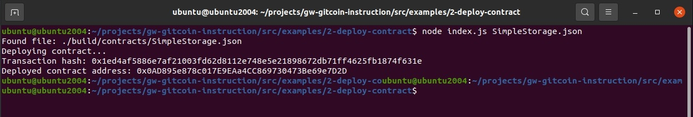

# Deploy A Simple Ethereum Smart Contract On Polyjuice

## Screenshot deployed contract

## Transaction Hash
0x1ed4af5886e7af21003fd62d8112e748e5e21898672db71ff4625fb1874f631e

## Contract Address
0x0AD895e878c017E9EAa4CC869730473Be69e7D2D
