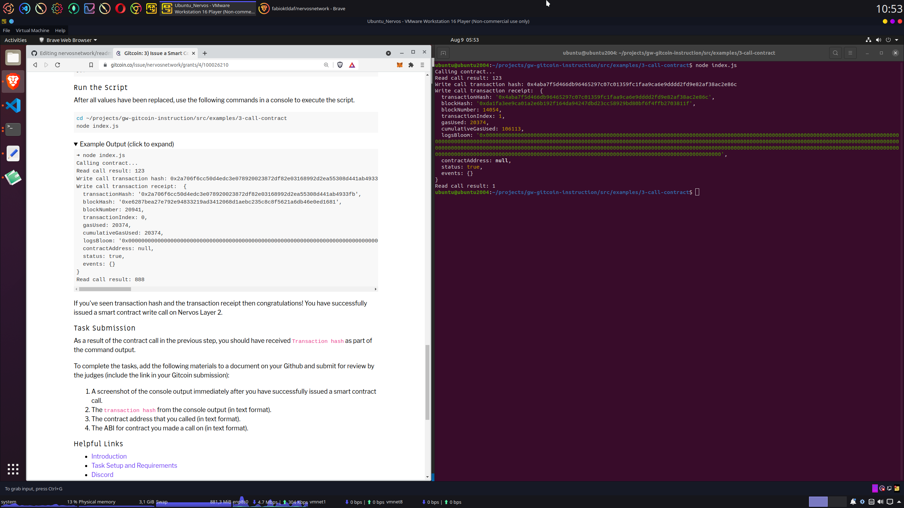

# Issue A Smart Contract Call To The Deployed Smart Contract


## Contract Address
0x0AD895e878c017E9EAa4CC869730473Be69e7D2D

## ABI
```
 [
    {
      "inputs": [],
      "stateMutability": "payable",
      "type": "constructor"
    },
    {
      "inputs": [
        {
          "internalType": "uint256",
          "name": "x",
          "type": "uint256"
        }
      ],
      "name": "set",
      "outputs": [],
      "stateMutability": "payable",
      "type": "function"
    },
    {
      "inputs": [],
      "name": "get",
      "outputs": [
        {
          "internalType": "uint256",
          "name": "",
          "type": "uint256"
        }
      ],
      "stateMutability": "view",
      "type": "function"
    }
  ] 
```

## Transaction Hash
0x4aba7f5d466db96465297c07c01359fc1faa9ca6e9dddd2fd9e82af38ac2e86c

## Screenshot smart contract call

