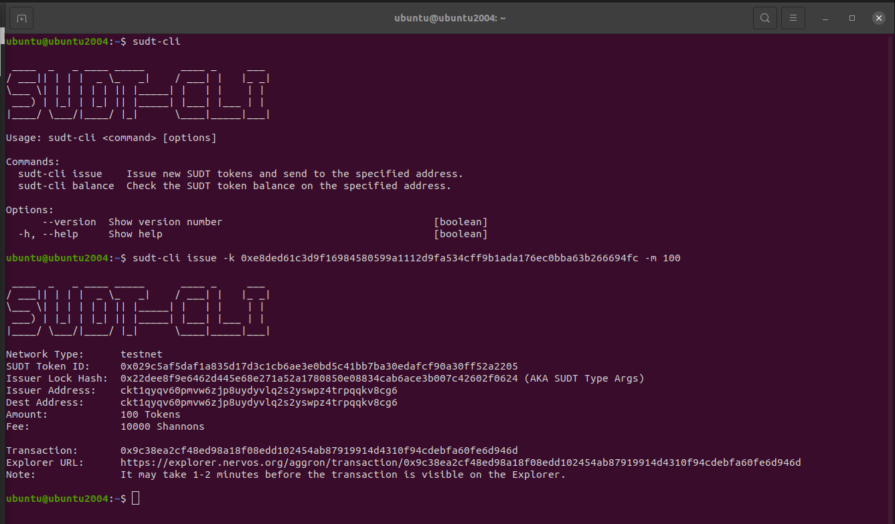
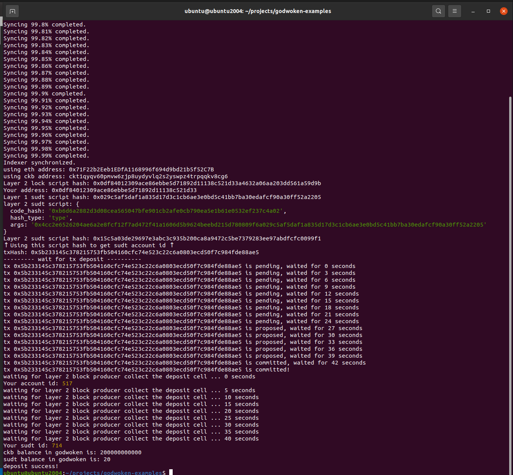

# Issue An SUDT Token On Layer 1 And Deposit It To Layer 2

## Testnet Explorer link to Layer 1 founded address
[https://explorer.nervos.org/aggron/address/ckt1qyqv60pmvw6zjp8uydyvlq2s2yswpz4trpqqkv8cg6](https://explorer.nervos.org/aggron/address/ckt1qyqv60pmvw6zjp8uydyvlq2s2yswpz4trpqqkv8cg6)

## Screenshot creation SUDT on Layer 1

## Testnet Explorer link to transaction id
[https://explorer.nervos.org/aggron/transaction/0x9c38ea2cf48ed98a18f08edd102454ab87919914d4310f94cdebfa60fe6d946d](https://explorer.nervos.org/aggron/transaction/0x9c38ea2cf48ed98a18f08edd102454ab87919914d4310f94cdebfa60fe6d946d)

## Screenshot deposit on Layer 2

## SUDT ID
714
