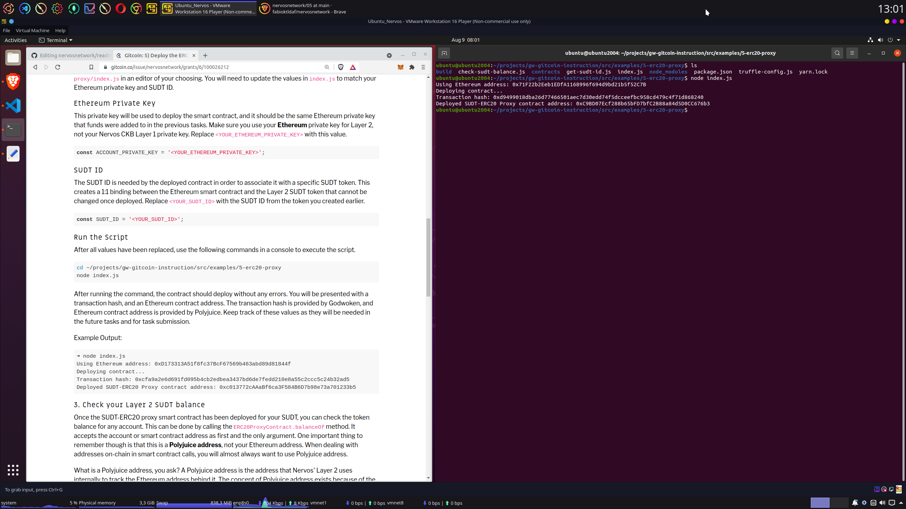
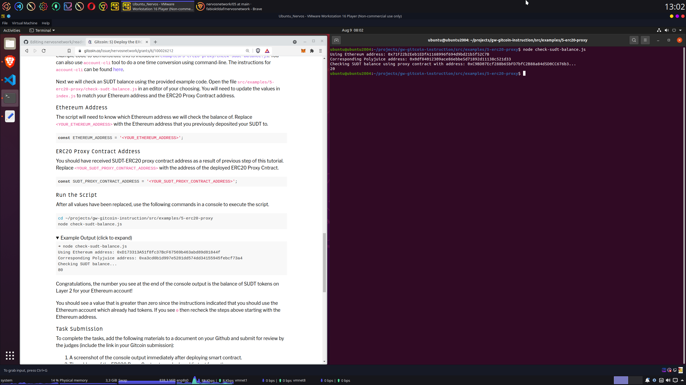

# Deploy The ERC20 Proxy Contract For The Deposited SUDT

## Screenshot smart contract deployed

## ERC20 proxy contract address
0xC9BD07Ecf288b65bFD7bfC2B88a84d5D0CC676b3

## Screenshot cheking SUDT balance

## Checked Ethereum address
0x71F22b2Eeb1EDfA1168996f694d9bd21b5f52C7B
