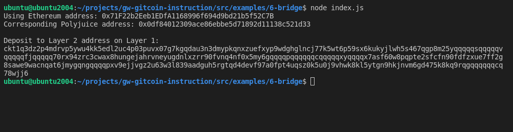

# Use Force Bridge To Deposit Tokens From Ethereum To Polyjuice

## 1. A screenshot of the console output immediately after you have successfully generated your Deposit Receiver Address.

## 2. Your Deposit Receiver Address.
ckt1q3dz2p4mdrvp5ywu4kk5edl2uc4p03puvx07g7kgqdau3n3dmypkqnxzuefxyp9wdghglncj77k5wt6p59sx6kukyjlwh5s467qgp8m25yqqqqqsqqqqqvqqqqqfjqqqqq70rx94zrc3cwax8hungejahrvneyugdnlxzrr90fvnq4nf0x5my6gqqqqpqqqqqqcqqqqqxyqqqqx7asf60w8pqpte2sfcfn90fdfzxue7ff2g8sawe9wacnqat6jmygqngqqqqpxv9ejjvgz2u63w3l839aadguh5rgtqd4devf97a0fpt4uqsz0k5u0j9vhwk8kl5ytgn9hkjnvm6gd475k8kq9rqgqqqqqqcq78wjj6

## 3. The Ethereum address used to generate the Deposit Receiver Address.
0x71F22b2Eeb1EDfA1168996f694d9bd21b5f52C7B

## 4. A link to the Etherscan explorer for the successful Force Bridge transaction.
[https://rinkeby.etherscan.io/tx/0x27284dba08d85f163ca9779c44ede8b23e26cd5191902816acc80d74089e60bf](https://rinkeby.etherscan.io/tx/0x27284dba08d85f163ca9779c44ede8b23e26cd5191902816acc80d74089e60bf)

## 5. A link to the Nervos explorer for the successful Force bridge transaction.
[https://explorer.nervos.org/aggron/transaction/0x088fe8c52dcc499dcf0f900dc6420353f357efe521228a76466a57943aea9771](https://explorer.nervos.org/aggron/transaction/0x088fe8c52dcc499dcf0f900dc6420353f357efe521228a76466a57943aea9771)
