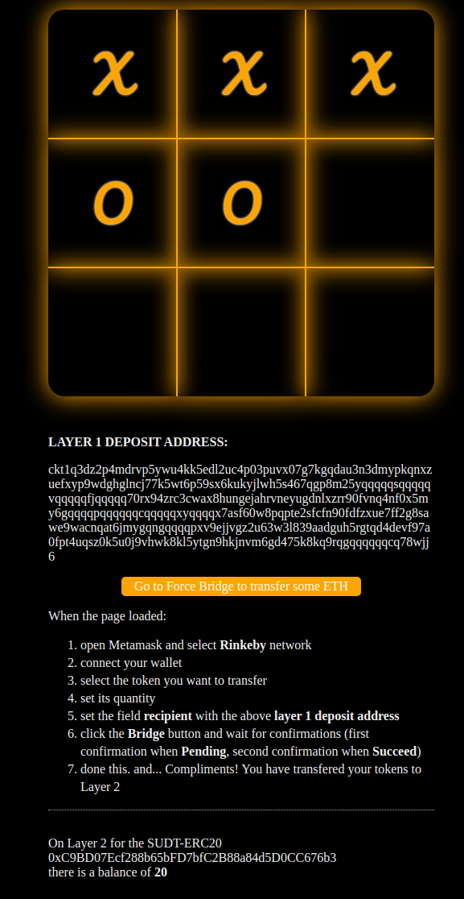

# 8) Modify The Ported DApp So It Supports Ethereum Assets Via Force Bridge 

## 1. A screenshot or video of your EVM application on Layer 2 with Force Bridge support.

## 2. The address of the SUDT-ERC20 Proxy Contract that you deployed.
0xC9BD07Ecf288b65bFD7bfC2B88a84d5D0CC676b3

## 3. A link to the GitHub repository with your EVM application that integrates Force Bridge support.
__[branch "nervos-bridge"](https://github.com/fabioktldaf/nervosnetwork/tree/main/08)__
