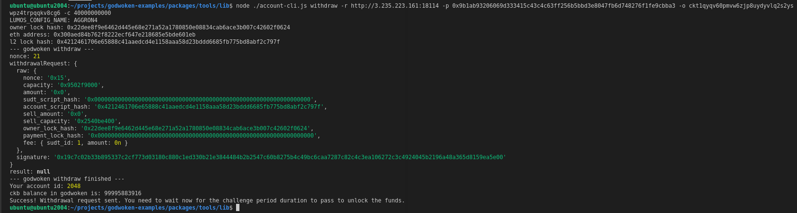

# 9) Initiate Withdrawal Process From The Layer 2 Back To Layer 1

## 1. A screenshot of the console output immediately after running the withdraw command.

## 2. The Ethereum address that you've used for your Layer 2 account.

0x300aED84b762f8222ecF647E218685e5bde601EB

## 3.The Nervos Layer 1 address that you passed to withdraw command.

ckt1qyqv60pmvw6zjp8uydyvlq2s2yswpz4trpqqkv8cg6
